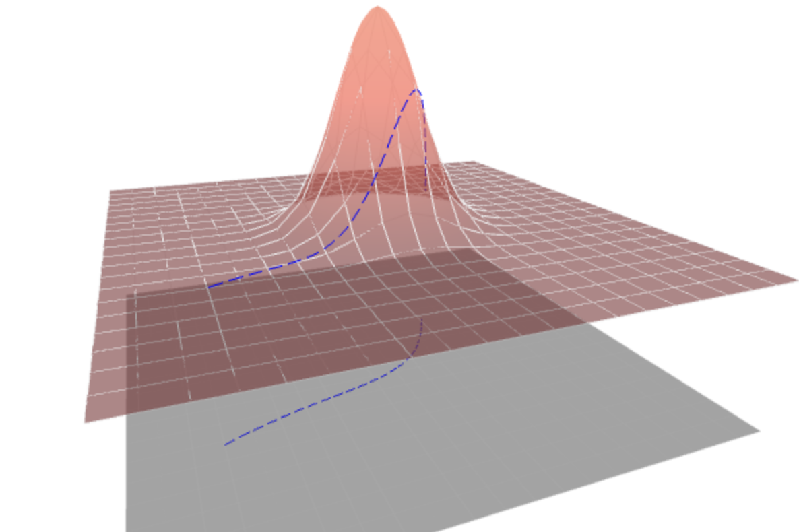
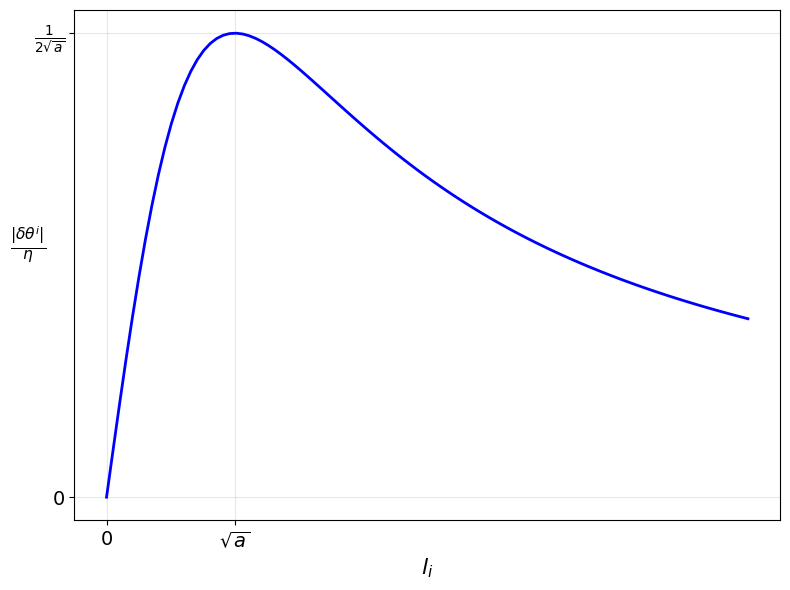

# Induced-Metric-Optimiser

**Figure 1.** _The proejection of a curve to the loss landscape from the higher dimensional space. When accounting for the higher dimensionanal space, the distance travelled is significantly further in highly curved regions._

This repository contains the experiments and implementation for induced metric optimisers. These are preconditioning-based optimisers that utilise the induced metric, which is often illustrated in graphical visualisations of loss landscapes. Specifically, the approach involves pulling back the metric from a higher-dimensional space onto the loss landscape. This can be interpreted as a smoothed variant of gradient clipping.

Implementations in both JAX and PyTorch are included, along with a file demonstrating the implementations are equivilent. All experiments were performed in JAX.

For further details, see the paper: https://arxiv.org/abs/2509.03594

---
**Figure 2.** _The parameter update vs the gradient, where a is a scale that depends on the local curvature._  

